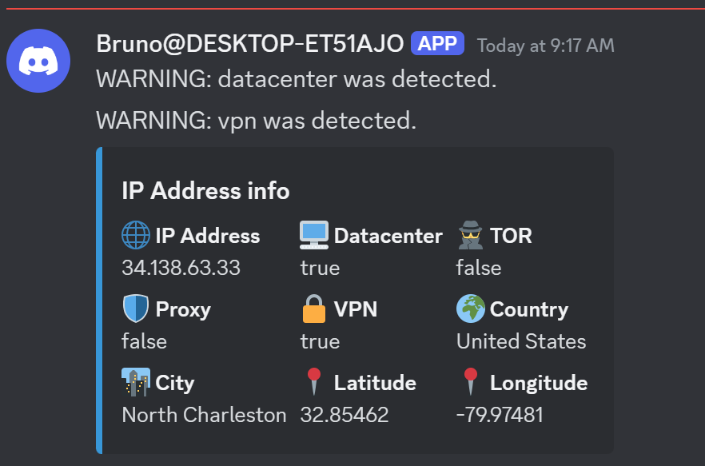
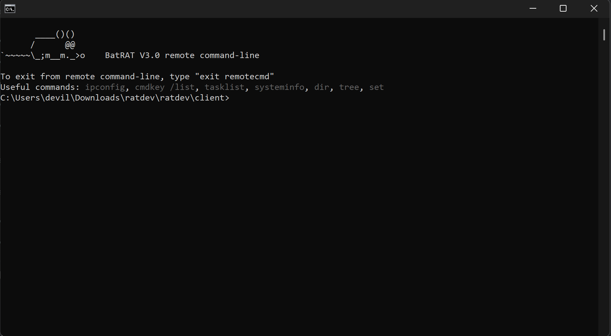
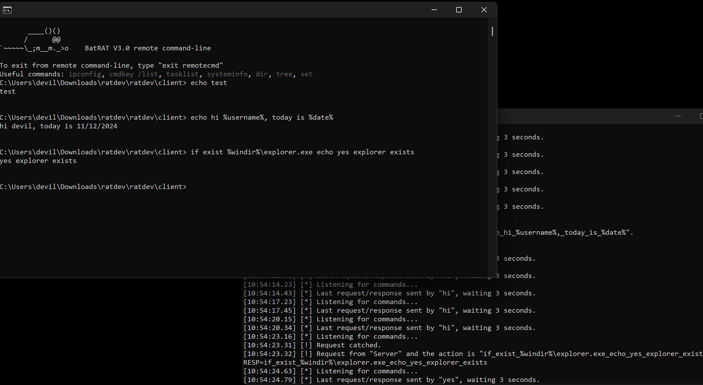
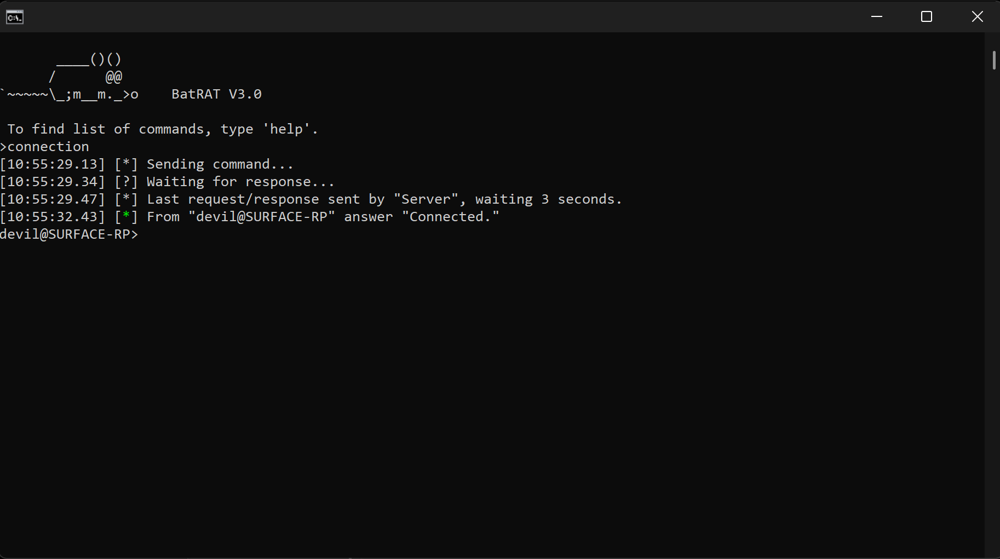

# BatRAT 3.0
🖥️ Fast, light-weight remote administration tool made purely in Batch, fully undetected by most anti-malware programs.
Some modules were made in NirCMD and PowerShell.

Note: The source code will be never released due to the potential of abuse. I do not want my program to be abused by threat actors to cause problems. I am making this GitHub as a documentation for my project.

---

## 🔑 How does it work?
There are 2 versions of BatRAT;
- Server
  - Sends commands on PHP website
  - Contains full list of commands
  - Server version has full control of client version
- Client
  - Accepts commands from PHP website that server sends
  - Does all the commands requested and returns on PHP website or a Discord webhook

1) PHP server needs to be setup as C&C
2) Server sends command on PHP server in format `Server;commandname`
3) Client receives command from PHP server, does the command, returns answer on PHP server in format `%username%@%computername%;answer`

---

## 🛠️ Features 
- Proxy, datacenter, VPN, Tor detection
- Virtual Machine detection
- Send IP address along with city, longitude, latitude on Discord webhook
- Fully stealth run in background with minimal usage
- Screenshot on Discord Webhook
- Clipboard content
- System info (GPU, CPU, RAM, registered owner...)
- Downloading from URL to target machine
- File uploading to Discord Webhook from target machine
- Remote command-line (1:1 to default command line)
- Shutdown, restart, logout
- Display message boxes, tray notifications
- Check for admin permissions
- Ask for admin permissions as CMD.exe
- Check for known debug/monitoring processes and if detected, pause listening
- Persistency
  - Task Scheduler
  - Registry
  - Start-menu folder
  - Windows service
- Logging keystrokes and send to Discord Webhook 
- Set attributes of BatRAT files to hidden, system
- Dump WiFi Passwords and SSID's

---

## 📚 Changelog
  - 2021 - **BatRAT 1.0**: Manual command input on `pastebin.com`, extremely unstable, limited version, output only on Discord webhooks, compared to other versions very slow.
  - 2022/23 - **BatRAT 2.0**: Usage from command-line only, used `rentry.org` for the first time, better version, but still unstable.
  - 2024 - **BatRAT 3.0**: Reliant on it's own server, no longer uses any paste service, extremely fast due to it's own server, very stable, 100% stable remote command-line.

---

## 🔒 Detection status
  - ✅ **Avast**: Fully bypassed. RAT was able to work without a single issue.
  - ✅ **Avira**: Fully bypassed.
  - ✅ **Windows Defender**: Fully bypassed.
  - ✅ **AVG**: Fully bypassed.
  - ✅ **KVRT (Kaspersky Virus Removal Tool)**: Full bypassed. Unable to test with normal Kaspersky/UltraAV.
  - ✅ **ESET Online Scanner**: Fully bypassed. I have no idea how that happened, since it does not bypass normal ESET.
  - ✅ **HitmanPro Scanner**: Fully bypassed.
  - ✅ **Malwarebytes scan & realtime protection**: Fully bypassed.
  - ⚠️ **ESET Endpoint Antivirus**: Fully bypassed with all modules including Live Grid enabled. RAT was able to work without single issue. Note: After 3 days, ESET is now detecting as BAT/Agent.DO. This is probably caused by Live Grid automatic file submitting system.
  - ❌ **BitDefender**: Every version of BatRAT 3.0 blocked as generic spyware. Hats off to BitDefender's heuristic analyze.

---

## 📷 Screenshots

